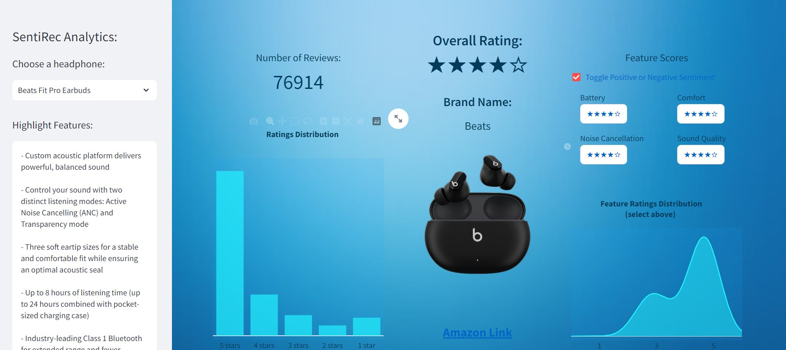

# Sentirec Analytics

## Introduction

The intended use for this project was to be a Micro-SaaS app to streamline up the process of finding a product (in the current iteration we are focusing on headphones) faster. The idea comes from the issue of spending lots of time reading top ten best of articles and watching youtube reviews of products, just to make a decision on what to buy. So taking all the information and putting it right in front of a user could be beneficial, with the intention that the user would make the purchase from our affiliate link. Thus, the crux of the project is to use NLP to summarize text and perform sentiment analysis with the goal of showing analytics of summaries of a collection of various reviews. Ideally, a recommendation system would couple this to help users in product selection. 

A demo of this app was made via streamlit. Below is a screenshot, and with a live link here: 
https://sentirec-analytics-zc5ua5ckka-uc.a.run.app/ (Note: give it a second to load, it can be a bit slow.)

### Features

- **Machine Learning:** Our recommendation engine uses HuggingFace libraries for text summarization and sentiment analysis on product reviews.

- **Extensive Database:** We have compiled a database of 20+ popular wireless earbuds, ensuring a wide range of options for users to explore.

- **User-Friendly Interface:** The website offers an intuitive and user-friendly interface to enhance the overall user experience.

- **Personalized Recommendations:** (coming soon) Users can input what they are looking for via text input.

## Data Collection

The app shows review analytics for headphones from amazon, so naturally amazon review data was used here. A website called Apify, which has a collection of APIs and web scrapers, was used to collect this data. The data was limited as only a free trial was used since this app is meant to be an MVP, and also there was an error where the web scraper would only pull 50 reviews per headphone, which seems to be some error. A minor workaround was done here where the reviews were location dependent, so 50 reviews were pulled from both amazons Canadian and US websites each. 

To get the YouTube data, google has a free API for YouTube, so a search was made using it for a certain headphone name's reviews, and then the cc text of the top 7 videos of the search results were collected for the YouTube review dataset. To summarize these reviews, a second dataset was collected via web scraping to fine tune on. This dataset comprised of cc text reviews again, but from the sound guys youtube channel. The reason for this was that a lot of their reviews had blog posts attached alongside the youtube video reviews, and in their blog posts they had short summaries of the overall review of the headphone. So these short summaries were scraped and paired with the youtube cc text for the fine-tuning dataset.

## EDA

Since most of the data was in text form, only a few notes here:

- Standard preprocessing was performed on all text data (lower casing, removing stop words, lemmatization, etc.).
- Since there was a few diferent datasets related to our headphone selection, the data was organized to follow a Star Schema.
- The fact table in the Star Schema has most of the relevant information, including review rating, sentiment analysis, etc.

## Modeling

The models used in this app were for text summarization and aspect based sentiment analysis. The aspects we looked at were battery, noise cancellation, sound quality, and comfort. An out of the box hugging face model was used to get these (the yangheng/deberta model). For text summarization, some fine-tuning was performed, although not much as the out of the box model seemed okay already. The google/pegasus model was used, resulting in a small improvement in the rouge metric, although something to be returned to in the future.

## Future Improvements and Revisions

There is a lot more to be done in this project to make it better, but will be dropped for now as it doesn't seem to be something anyone is interested in. Although, some noteworthy revisions would be:

- Aspect based sentiment analysis should be revised, and NER should be used, or something to detect notable features per headphone, as not every headphone was made with certain aspects in mind so there was no sentiment scores for them.
- Absa should be done on youtube reviews as well.
- YouTube review summarization model can be fine tuned further.
- The app should focus more on review analytics of youtube reviews since amazon review analytics are already done on the amazon website and are redundant.
- The app itself needs to be redone with django or something else as streamlit is slow and elementary. 
